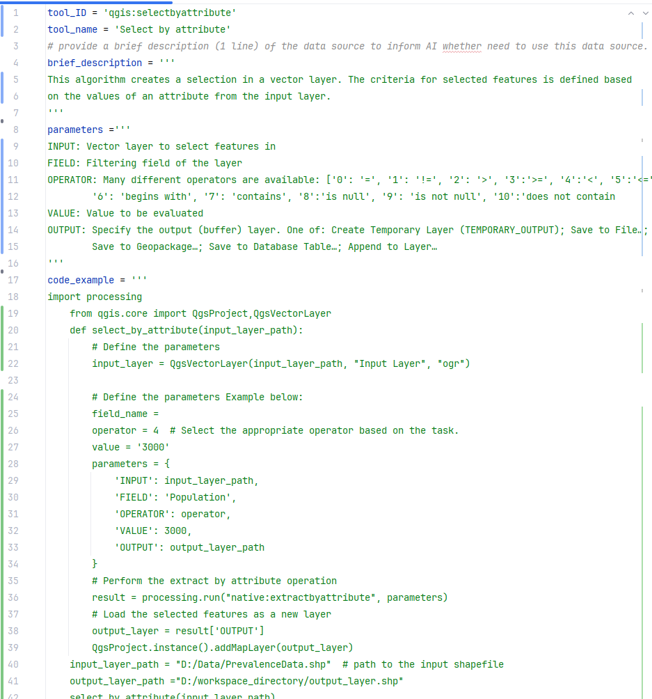

# Contributing to the plugin
You're welcome to contribute to this plugin! Feel free to add documentation for any tool, whether it's a QGIS geoprocessing tool or a custom tool like geopandas functions. Below is a guide on how to add tool documentation to your local computer and to the GitHub repository, helping to enhance the performance of the agent.
# Tool documentation format
 A tool documentation consists of four sections: ```tool_ID```, ```tool_name```, ```brief_description```, ```parameters```, and ```code_example``` which are saved in a ```Tom's Obvious Minimal Language (.toml)``` file.

## ```tool_ID```
### QGIS processing tool ID
Typically, QGIS processiong tools consist of two words one of - gdal, native, pdal,or qgis- and the name of the processing tool. For example the id of the tool for select by attribute is ```qgis:selectbyattribute```. The QGIS tool_ID with their corresponding names can be generated using the code below. It is strongly recommended to run these codes in the QGIS python console.

```python
for alg in QgsApplication.processingRegistry().algorithms():
     print(alg.id(), "->", alg.displayName())
```
### Customize tool ID
To define a tool_ID for a customized tool, ensure that it adheres to the following rules: _**it must be simple and descriptive**_ ; _**contains only lowercase letters and underscore without any spaces oe special characters**_. For example a valid tool_ID would be : ```thematic_map_creation```.

## ```brief_description```
A brief description (usually 1-2 sentence) of the tool should be provided. For QGIS processing tools, you can get the description by printing the help of any QGIS tool (see the code below). Conversely, for a customize tool a short description should be provided. For example the description of the ```Select by attribute``` tool is: 
_```"This algorithm creates a selection in a vector layer. The criteria for selected features is defined based on the values of an attribute from the input layer."```_  

```python
processing.algorithmHelp("tool_ID")

#Example the Select by attribute tool
processing.algorithmHelp("qgis:selectbyattribute")
```
## ```parameters```
In QGIS, processing tools typically require several parameters to define inputs, settings, and options necessary for the tool to run properly. These parameters specify the data, configurations, and choices that influence how the tool operates. 
The description of the parameters of each QGIS processing tools can be found on the [QGIS algorithm provider website](https://docs.qgis.org/3.34/en/docs/user_manual/processing_algs/qgis/index.html). Some few details of each parameter can be accessed by running the code provided above on the QGIS python console.

## ```code_example```
The code_example provides a practical example of how to use QGIS's processing tools with python to perform any operation. Typically, QGIS processing tools have similar format of code. The general format is described below. 
```plaintext
1. Import Libraries
   └── Import the required QGIS and processing modules.

2. Load Input Layer
   └── Load the vector layer (e.g., shapefile) using `QgsVectorLayer`.

3. Define tool Parameters
   └── Set the parameters needed for the tool, such as INPUT, output settings, etc.

4. Execute Buffer Operation
   └── Run the buffer tool using `processing.run()` with the defined parameters.

5. Load Output Layer
   └── Add the buffered layer to the QGIS project using `QgsProject.instance().addMapLayer()`.
 ```
Also an example has can be seen in the image below.

### An example of a tool documentation file




# How to add tool documentation to the local machine
To add a documentation file (.toml) on your local machine, use the ```Add a documentation file``` button within the plugin. This allows you to select and automatically add a documentation file from any location on your local machine to the documentation folder within the plugin directory (```C:\Users\YOUR_USERENAME\AppData\Roaming\QGIS\QGIS3\profiles\default\python\plugins\SpatialAnalysisAgent-master\SpatialAnalysisAgent\Tools_Documentation```). **Note:** Replace "YOUR_USERNAME" with your actual username in the file path. Alternatively, you can manually add the documentation file by copying it directly to the specified plugin directory.


# How to add tool documentation to the github repository
To add tool documentation to the github repository, use the ```Contribute``` button on the plugin to open the ```Contribute to Spatial Analysis Agent``` dialog. Then follow the steps below. **Note:** you will need to input your GitHub username and a GitHub personal access token. [Learn how to get a token](https://docs.github.com/en/authentication/keeping-your-account-and-data-secure/managing-your-personal-access-tokens#creating-a-personal-access-token-classic). Ensure the token has ```repo``` and ```workflow``` permissions. You can do this by adding them in the ```Select scopes``` when creating your personal token.
- Fork the plugin repository on GitHub: [Click Here.](https://github.com/Teakinboyewa/SpatialAnalysisAgent)
- Clone your fork to your local machine. Learn more on [Cloning a repository](https://docs.github.com/en/repositories/creating-and-managing-repositories/cloning-a-repository)
- Upload a TOML file using the ```Contribute to Spatial Analysis Agent``` dialog within the plugin. The uploaded TOML file will go to your forked repository.
- After uploading, go to GitHub and **open a pull request** from your forked to the main repository.